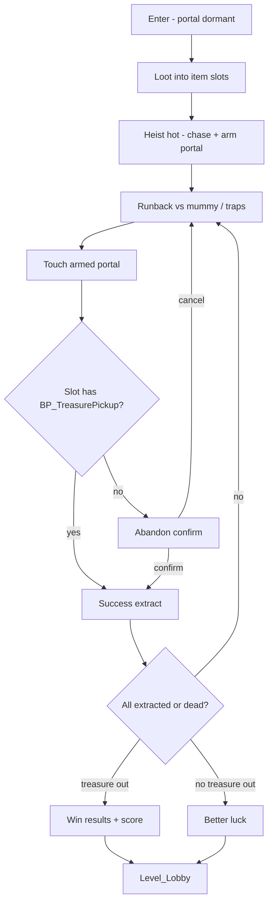

# Pyramid Robbers — Heist Hot Phase + Portal Extract Plan

> **Resume tip:** Read this file first after any context reset. Do **not** re-open the older Cursor plan `escape_mummy_chase_13de86f3.plan.md` as source of truth — win condition evolved (portal + inventory + results UI).

**Project:** PyramidRobbersV2 (UE 5.7)  
**Level:** `/Game/Game_levels/Level_Pyramid`  
**Tooling:** UE-MCP (`project-0-PyramidRobbersV2-ue-mcp`) — call `project(action="get_status")` first  
**Last updated:** 2026-07-19

---

## 1. Locked player fantasy

1. Enter pyramid through the single choke (portal **dormant** — no win/lose on entry).
2. Loot `BP_TreasurePickup` into thief item slots.
3. Heist goes **hot** → mummy chase + portal **arms** (`NS_Portal` cue).
4. Players run back through traps to the starting portal while chased.
5. Armed portal interaction:
   - Inventory has `BP_TreasurePickup` → **success extract**.
   - No treasure → **Abandon heist?** confirm → extract with 0 treasures (or cancel and stay).
6. When **every player is Extracted or Dead**, resolve the round:
   - Any escaped player brought ≥1 treasure → **congratulate** + score.
   - Zero treasures escaped → **Better luck** screen.
7. After results UI → travel to `Level_Lobby`.



---

## 2. Locked design decisions

| Topic | Decision |
|--------|----------|
| Win geometry | Entrance **portal** (`BP_LevelTrigger` / extract BP) — **not** treasure gate |
| Portal before hot | **Dormant** — overlap ignored (optional hint only) |
| Empty-handed at portal | **Abandon prompt** (fail/abandon), not “go grab something” |
| Round end | When all players are **Extracted or Dead** |
| Team win | ≥1 extracted player carried ≥1 treasure |
| Team fail | No treasures made it out (wipes / only abandons) |
| Score | `(PlayersEscaped * P) + (TreasuresEscaped * T)` — suggested P=100, T=250 |
| Treasure gate | Stays **key access into loot wing only** |
| Old `BP_EscapeExit` “any thief → Lobby” | **Superseded** — rework or replace with portal extract flow |

### Hot-phase trigger (to implement)

Prefer hybrid:

- **First loot** starts a chase countdown (replicated HUD timer).
- Timer expiry **or** last loot (whichever first) → set escape/hot → awaken mummy → **arm portal**.

Exact countdown seconds: TBD in PIE (start ~60s).

---

## 3. Key assets

| Asset | Path | Role |
|--------|------|------|
| GameMode | `/Game/ThirdPerson/Blueprints/BP_ThirdPersonGameMode` | Spawn loot, `ReportTreasureCollected`, start hot/chase |
| GameState | `/Game/Core/BP_PyramidGameState` | `bEscapePhase`, treasure progress; extend for extract/score |
| Thief | `/Game/ThirdPerson/Blueprints/BP_Thief` | Inventory slots; `MarkEscaped` / `IsEscaped` / `bEscaped` exist |
| Treasure pickup | `/Game/Gameplay/Pickups/BP_TreasurePickup` | Loot item / overlap collect |
| Escape exit (old) | `/Game/Gameplay/Pickups/BP_EscapeExit` | Graph wired for phase+count→Lobby — **replace logic with portal rules** |
| Level trigger | `/Game/Game_levels/BP_LevelTrigger_Base` | Existing OpenLevel pattern — base or child for extract |
| Portal FX | `/Game/Assets/Portal_Gate/NS_Portal` | Arm + extract VFX |
| Portal mat | `/Game/Assets/Portal_Gate/M_Portal` | Visual arm state |
| Mummy | `/Game/AI_Enemy/BP_Mummy` | `StartChase`; keep `bChaseOnBeginPlay = false` |
| Awakening seq | `/Game/Cinematics/LS_MummyAwakening` | Play on hot, then `StartChase` (server delay — not latent inside Multicast) |
| Pyramid map | `/Game/Game_levels/Level_Pyramid` | Place mummy + armed portal at start choke |
| Lobby | `/Game/Levels/Level_Lobby` | Post-results travel target |

**Inventory check:** On portal interact, scan thief item slots; if any held item is `BP_TreasurePickup` (or tagged Treasure), allow success extract; else show abandon UI.

---

## 4. Already done

- [x] `ReportTreasureCollected` True branch → one-shot `bEscapeStarted` → `SetEscapePhase` → `SyncTreasureProgress` → `Multicast_BeginEscape`
- [x] GameState vars: `bEscapePhase`, `TreasureCollected`, `TreasureTotal` (+ sync helpers)
- [x] `Multicast_BeginEscape` prints escape toast and calls `BP_Mummy.StartChase` (no level sequence delay yet)
- [x] `BP_EscapeExit` EventGraph compiles (authority → thief → escape phase → mark escaped → count → OpenLevel Lobby)
- [x] `BP_Thief.MarkEscaped` sets `bEscaped`; `IsEscaped` returns it
- [x] Level save fix: removed orphaned `ShakeAnim` TimelineComponents from all `BP_TrapRow` instances in Pyramid

**Not placed in `Level_Pyramid` yet:** `BP_Mummy`, `BP_EscapeExit` / extract portal instance.

---

## 5. Implementation steps (do in order)

### Step A — Hot phase from first loot (+ optional last-loot snap)
**Owner assets:** `BP_ThirdPersonGameMode`, `BP_PyramidGameState`

1. Add replicated `ChaseCountdownRemaining` (float/int) + `bHeistHot` (or reuse `bEscapePhase` as “hot”).
2. On **first** successful `ReportTreasureCollected`, start server timer (DoOnce).
3. On timer end **or** `TreasureCollected >= TreasureTotal`, call existing escape/hot handoff (SetEscapePhase + Multicast awaken).
4. Replicate countdown for HUD.

**Acceptance:** First pickup starts timer; clients see it; hot fires once.

---

### Step B — Place dormant mummy + awakening beat
**Owner assets:** `Level_Pyramid`, `BP_Mummy`, `BP_PyramidGameState` Multicast

1. Place one `BP_Mummy` near sarcophagus / treasure room; `bChaseOnBeginPlay = false`.
2. Multicast: play `LS_MummyAwakening` (visual).
3. **Server** Delay (sequence length or ~3–4s) → `StartChase` (do not put latent Delay inside Multicast RPC).
4. Optional soft input lock during awakening.

**Acceptance:** Mummy idle until hot; then cinematic/chase.

---

### Step C — Portal extract BP (replace simple EscapeExit travel)
**Owner assets:** new child of `BP_LevelTrigger_Base` **or** rework `BP_EscapeExit` at entrance

1. Place extract volume at **pyramid start / entrance choke** (same door players entered).
2. If **not** hot/escape phase → return (dormant). Optional print/hint.
3. Cast overlapping actor to `BP_Thief`.
4. **Inventory scan** for `BP_TreasurePickup` in item slots:
   - Found → `ExtractPlayer(Success, TreasureCount)`.
   - Missing → show **Abandon heist?** widget (local owning client); on confirm → `ExtractPlayer(Abandon, 0)`.
5. On extract: play `NS_Portal` on that player; `MarkEscaped`; record treasures carried out on GameState/PlayerState; remove/spectate pawn.
6. **Do not** OpenLevel on first extract.

**Acceptance:** Entry before hot does nothing; with loot extracts; without loot only abandon path.

---

### Step D — Round resolve + score + UI
**Owner assets:** `BP_PyramidGameState` / GameMode, widgets

1. Track: living players in pyramid, extracted list, `TreasuresEscaped`, `PlayersEscaped`.
2. When no living in-level players remain → `ResolveHeist`:
   - If `TreasuresEscaped > 0` → Win/results widget (congrats + score).
   - Else → Better luck widget.
3. Score = `(PlayersEscaped * 100) + (TreasuresEscaped * 250)` (tunable constants).
4. After UI dismiss / short delay → server `OpenLevel` `Level_Lobby`.

**Acceptance:** Solo extract with loot → win UI → Lobby. Solo abandon only → better luck. 2P: wait for both resolve.

---

### Step E — Pickup harden
**Owner assets:** `BP_TreasurePickup`, GameMode spawn

1. Add `bCollected` one-shot before `ReportTreasureCollected` + destroy.
2. Confirm `TreasureTotal` equals **successful spawn count** (not Max(players, debug) alone).

**Acceptance:** Double-overlap cannot double-count; win/hot math cannot soft-lock on failed spawns.

---

### Step F — Wire level + VFX polish
1. Confirm Pyramid GameMode = `BP_ThirdPersonGameMode`, GameState = `BP_PyramidGameState`.
2. Portal mesh/material uses `M_Portal`; arm enables `NS_Portal`.
3. Navmesh covers mummy chase through trap corridor.
4. Save map; avoid reintroducing TrapRow timeline private refs.

---

### Step G — Playtest checklist
- [ ] Solo: enter (dormant) → loot → hot/chase → extract with treasure → win UI → Lobby
- [ ] Solo: extract attempt with empty slots → abandon → better luck
- [ ] Solo: touch portal before hot → nothing
- [ ] 2-client: only authority increments loot; both see hot; resolve waits for both; score counts both escapers/treasures
- [ ] Negative: mummy idle until hot; treasure gate is not win

---

## 6. Suggested score constants (defaults)

```
PlayerEscapePoints = 100   // per extracted player (success or abandon)
TreasureEscapePoints = 250 // per BP_TreasurePickup extracted
```

Show both counts on results so the formula is readable.

---

## 7. Out of scope (this pass)

- Redesigning `BP_TreasureGate` key puzzle
- Trap-row physics polish
- Donkey carry loot
- Partial-loot optional escape as separate mode
- Full polished menu shell beyond Win / Better luck widgets

---

## 8. Known hazards

- **Latent Delay inside Multicast** will not resume reliably — keep delays on server graphs.
- **One choke door:** portal must stay dormant until hot or entry will false-trigger.
- **TrapRow save error:** illegal private `ShakeAnim` TimelineTemplate refs — do not re-add instance timeline overrides; if save fails again, remove `ShakeAnim` from TrapRow instances.
- **UE-MCP:** prefer native blueprint/level tools; `execute_python` is gated last resort.

---

## 9. Progress tracker (update checkboxes as you go)

- [x] A0 — All-loot / escape handoff + GameState replication (legacy path)
- [x] A — First-loot chase timer + hot hybrid (60s; timer OR all-loot → hot once)
- [x] B — Place mummy + server Delay 3.5s → StartChase (Multicast toast only; LS_MummyAwakening still optional polish)
- [x] C — Portal extract + inventory (`TreasuresCarried`) + empty-slot auto-abandon (print)
- [x] D — Resolve + score + Print win/better-luck → Lobby (no WBP yet)
- [x] E — Pickup `bCollected` + `AddTreasure` on thief; TreasureTotal from spawn count
- [x] F — Level: `BP_Mummy_Heist` + `BP_ExtractPortal` near PlayerStart; `NS_Portal` on PortalFX (auto-activate off)
- [x] G — PIE smoke: level boots, thief + mummy + 1 loot spawn; full loot→chase→extract loop still needs manual playtest
- [ ] G2 — Manual: solo full loop + 2-client resolve (user)

### Implementation notes (2026-07-19)

- Treasure carry uses **`TreasuresCarried` counter** (not full `BP_MasterItem` reparent). Extract: `HasTreasureInActiveSlot` / `ConsumeTreasuresForExtract`.
- Empty portal = auto-abandon with print (no confirm widget yet).
- Results = **Print String** then 4s → `Level_Lobby` (no `WBP_HeistResults` yet).
- `LS_MummyAwakening` not wired — toast + delay + `StartChase` instead.
- Arm `PortalFX` (Activate) on hot still TODO for polish.
- If map save fails: strip `ShakeAnim` TimelineComponents from all `BP_TrapRow` instances again.

**Next action for a fresh agent:** Run **Step G** playtest checklist. Then polish: abandon confirm widget, `WBP_HeistResults`, activate `NS_Portal` on hot, optional `LS_MummyAwakening`.
`}